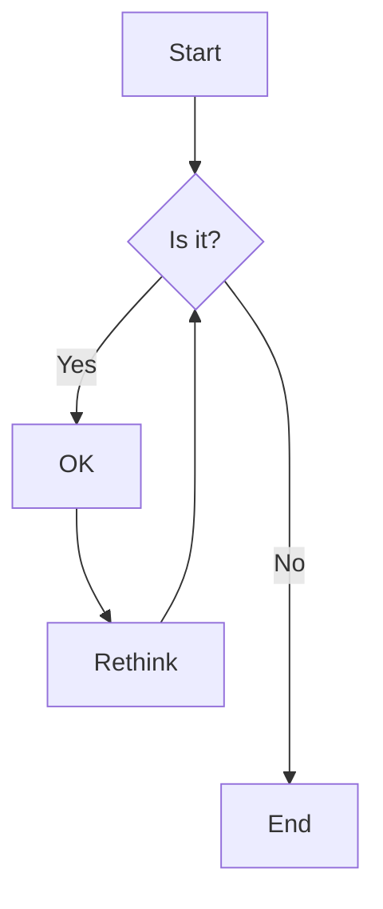
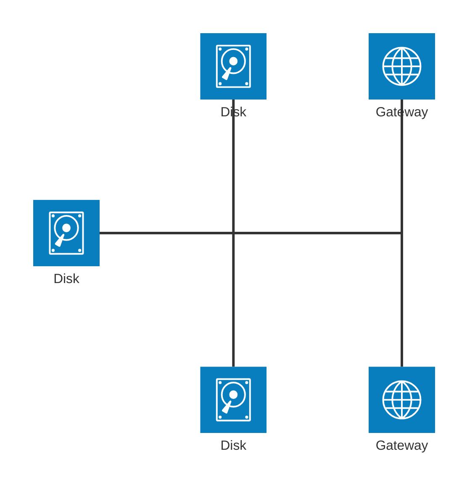

# Mermaid js examples

## Flowchart example

```mermaid
flowchart TD
    A[Start] --> B{Is it?}
    B -->|Yes| C[OK]
    C --> D[Rethink]
    D --> B
    B ---->|No| E[End]
```

## Architecture diagram

```mermaid
architecture-beta
    service left_disk(disk)[Disk]
    service top_disk(disk)[Disk]
    service bottom_disk(disk)[Disk]
    service top_gateway(internet)[Gateway]
    service bottom_gateway(internet)[Gateway]
    junction junctionCenter
    junction junctionRight

    left_disk:R -- L:junctionCenter
    top_disk:B -- T:junctionCenter
    bottom_disk:T -- B:junctionCenter
    junctionCenter:R -- L:junctionRight
    top_gateway:B -- T:junctionRight
    bottom_gateway:T -- B:junctionRight


```
