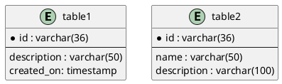
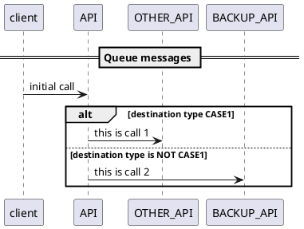

# Plantuml

```plantuml
@startuml

entity "table1" {
  *id : varchar(36)
  --
  description : varchar(50)
  created_on: timestamp
}

entity "table2" {
  *id : varchar(36)
  --
  name : varchar(50)
  description : varchar(100)
}
```

```plantuml
@startuml

participant "client" as client
participant "API" as api
participant "OTHER_API" as other_api
participant "BACKUP_API" as backup_api

== Queue messages ==

client -> api : initial call 
alt destination type CASE1
    api -> other_api : this is call 1
else destination type is NOT CASE1
    api -> backup_api: this is call 2
end
```

